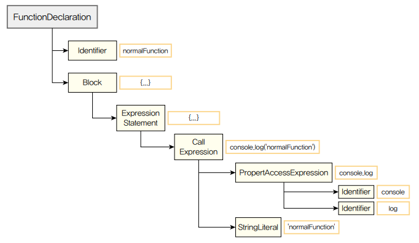

# 6주차 COW WEB-DEEP DIVE

## 1. 자바스크립트의 런타임과 타입스크립트의 컴파일 타임

- 프로그래밍 언어는 일반적으로 고수준과 저수준 언어로 구분할 수 있다.
- 고수준 언어는 사람이 이해하기 쉬운 형식으로 작성된다.
- 저수준 언어는 컴퓨터가 이해하기 쉬운형식으로 작성된다.
- 자바스크립트는 대표적인 고수준 언어에 속하며 컴파일러에 의해 저수준 프로그래밍 언어로 번역되어 실행된다.

### 자바스크립트 런타임

- 런타임이란 코드가 실행되는 시점을 말하는데 대표적으로 크롬이나 사파리 같은 인터네 브라우저와 Node.js 등이 있다.
- 자바스크립트는 동적 타입 언어로, 변수 타입이 실행 중에 결정되며, 잘못된 타입이라도 런타임 까지는 아무런 오류를 내지 않는다.
- 하지만 이로 인해 런타임 오류가 발생할 수 있으며 규모가 커질수록 그 위험도가 증가한다.

### 타입스크립트의 컴파일 타임

- 타입스크립트는 `.ts` 파일을 컴파일해서 `.js` 파일로 변환한다.
- 이 과정에서 타입 검사, 문법 검사, 코드 변환이 함께 이뤄진다.
- 타입스크립트는 실행 환경이 아니므로 런타임 에러는 잡지 못한다.
- 타입스크립트는 이 컴파일 타임으로 런타임 전에 타입 안정성을 확보한다.

## 2. 타입스크립트의 컴파일러 구조

타입스크립트 컴파일러는 타입스크립트 소스코드를 자바스크립트 변환한다. 타입스크립트 컴파일러는 이 다섯 단계를 거쳐 타입 검사와 자바스크립트 소스변환을 진행한다.


### 스캐너

타입스크립트 소스를 자바스크립트로 변환하기 위한 첫 번째 단계는 스캐너이고 스캐너는 타입스크립트 소스 파일을 어휘적으로 분석하여 토큰을 생성하는 역할을 한다.

### 파서(Parser)

스캐너가 소스파일을 토큰으로 나눠주면 파서는 그 토큰 정보를 이용하여 AST를 생성한다. 

- AST란? 추상 구문 트리를 의미하며, 프로그래밍 언어 소스 코드를 트리 구조로 나타낸 데이터 구조를 지칭한다. AST의 최상의 노드는 타입스크립트 소스파일 이며, 최하위 노드는 파일의 끝 지점으로 구성된다.

스캐너가 어휘적 분석을 통해 토큰 단위로 소스코드를 나누지만 파서는 이렇게 생성된 토큰 목록을 활용하여 구문적 분석을 수행한다. 



### 바인더(Binder)

바인더의 주요 역할은 체커 단계에서 타입 검사를 할 수 있도록 기반을 마련하는 것이다. 바인더는 타입 검사를 위해 심볼이라는 데이터 구조를 생성한다. 

- 심볼: 심볼 은이전 단계의 AST에서 선언된 타입의 노드 정보를 저장한다.

따라서 바인더는 심볼을 생성하고, 그에 대응하는 AST 노드를 연결하는 역할을 한다.

### 체커(checker) 와 이미터(Emitter)

체커는 파서가 생성한 AST와 바인더가 생성한 심볼을 활용하여 타입 검사를 수행한다.

> 이 단계에서 체커의 소스크기는 2.7MB 정도로, 이전 단계에서 파서의 소스크기인 500KB 보다 매우 크다. 이것을 봤을 때 전체 컴파일 과정에서 타입 검사가 차지하는 비중이 크다는 것을 짐작할 수 있다.
> 

이미터는  타입스크립트 소스 파일을 변환하는 역할을 한다. 즉 타입스크립트 소스를 `.js` 파일과 타입 선언 파일 `d.ts` 로 생성한다.

- TS 소스파일을 변환하는 과정에서 개발자가 설정한 TS 설정파일을 읽어오고 체커를 통해 코드에 대한 타입 검증 정보를 가져온다.
- 그리고 emitter.ts 소스 파일 내부의 emitFiles() 함수를 사용하여 타입스크립트 소스 변환을 진행한다.

### 타입스크립트의 컴파일 과정 정리

1. tsc 명령어를 실행하여 프로그램 객체가 컴파일 과정을 시작한다.
2. 스캐너는 소스 파일을 토큰 단위로 분리한다.
3. 파서는 토큰을 이용하여 AST를 생성한다.
4. 바인더는 AST의 각 노드에 대응하는 심볼을 생성한다. 심볼은 선언된 타입의 노드 정보를 담고 있다.
5. 체커는 AST를 탐색하면서 심볼 정보를 활용하여 타입 검사를 수행한다.
6. 타입 검사 결과 에러가 없다면 이미터를 사용해서 자바스크립트 소스 파일로 변환한다.

## 3. API 요청

api 요청이란 클라이언트가 서버에 데이터를 요청하거나 보내는 과정을 말한다. 웹 애플리케이션에서 사용자 UI와 서버 간의 데이터를 주고받기 위해 반드시 필요하며, 비동기 방식으로 처리되는 것이 일방적이다.

### `fetch` vs `axios`

`fetch`와 `axios`는 둘 다 HTTP 요청을 보내고 응답을 받아오는 기능을 제공하지만 둘의 차이가 있다.

| 항목 | `fetch` | `axios` |
| --- | --- | --- |
| 기본 제공 여부 | ✅ 브라우저 내장 | ❌ 외부 라이브러리 설치 필요 |
| JSON 파싱 | ❌ 수동 (`res.json()`) | ✅ 자동 (`res.data`) |
| 요청/응답 가공 | ❌ 불편 | ✅ 인터셉터 기능 제공 |
| 에러 핸들링 | ❌ HTTP 에러는 직접 확인 필요 | ✅ `catch`로 분기 처리 |
| 타임아웃 | ❌ 직접 구현 필요 | ✅ 기본 제공 |
| 사용 편의성 | 기본적이지만 단순 | 편리하고 강력 |

타입스크립트에서 `fetch`와 `axios` 의 사용방식은 자바스크립트에서와 동일하지만, 정적 타입 시스템의 도움을 받아 더 안전하게 사용할 수 있다는 차이가 있다. (ex: 타입 선언)

```tsx
interface Todo {
	id: number;
	title: string;
	completed: boolean;
}

const fetchTodo = async (): Promise<Todo> => {
	const res = await fetch("[https://](https://jsonplaceholder.typicode.com/todos/1)www.todo.com/123");
	const data = await res.json();
	return data;
};
```

- 위처럼 코드를 짠다면 `id, title, comleted` 의 타입을 다 지정해줘서 타입 안전성을 고려한 코드를 짤 수 있다.

API 상태관리에 대한 내용은 좀 더 공부해서 다음주 까지 정리해서 올려보도록 하겠습니다.